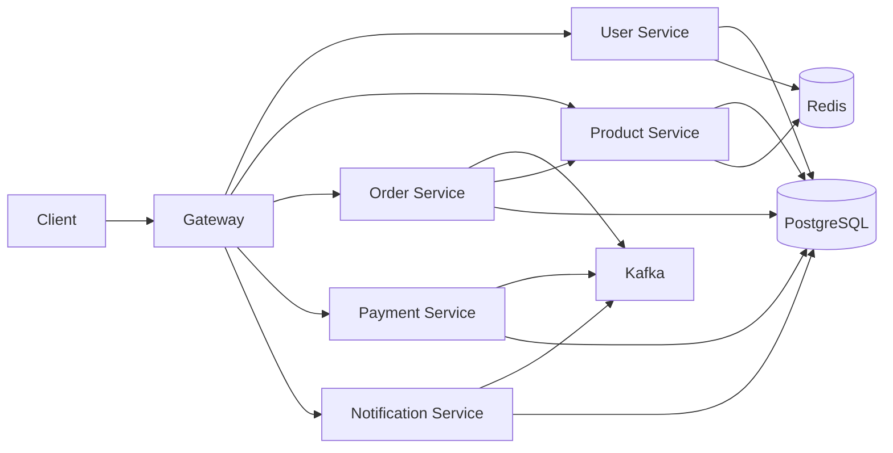

# E-Commerce

A distributed e-commerce backend made of Spring Boot microservices. It uses PostgreSQL per service, Redis for caching and auth token handling, Apache Kafka for asynchronous order and payment flows, and Zipkin-compatible tracing. Everything needed for local development is orchestrated with Docker Compose.

## Architecture

Traffic enters through the **API Gateway** (`:8080`), which routes `/api/**` requests to the appropriate service by path. Each service owns its PostgreSQL database (created on first Postgres startup). **Order placement** publishes an `order-placed` event; the **payment** service consumes it, records a payment, and publishes `payment-processed`; the **order** service updates order status from that topic, and the **notification** service persists user-facing notifications from both topics.



## Tech stack

| Area | Technology |
|------|------------|
| Language & runtime | Java **17** |
| Framework | **Spring Boot 3.2** (Web, Data JPA, Security, Kafka, Actuator, Validation) |
| API gateway | **Spring Cloud Gateway** (WebFlux) |
| Databases | **PostgreSQL 15** (one database per service via init script) |
| Migrations | **Flyway** |
| Messaging | **Apache Kafka** (Confluent 7.5 images) + **Zookeeper** |
| Cache | **Redis 7** |
| API docs | **springdoc-openapi** (Swagger UI on each REST service) |
| Tracing | **Micrometer Tracing** → **Zipkin** |
| Containers | **Docker** & **Docker Compose** |
| Build | **Maven** |

Supporting containers: **Kafka UI** (browse topics), **Zipkin** (trace UI).

## Features

### User service (`:8081`)

- Register, login, refresh, and logout with **JWT** access and refresh tokens.
- **BCrypt** password hashing.
- **Redis** for logout / token invalidation semantics.
- Protected user profile APIs: get and update by user id (self or `ROLE_ADMIN` only).
- OpenAPI at `/swagger-ui.html` (and `/api-docs`).

### Product service (`:8082`)

- CRUD product catalog (SKU uniqueness, stock, price, category, active flag).
- **Redis** cache for single-product reads (TTL ~10 minutes) with invalidation on writes.
- Prometheus-ready metrics exposure (see `application.yml`).

### Order service (`:8083`)

- Place orders with line items; validates products via **REST** call to product service (price snapshot, stock, active flag).
- Persists orders and publishes **`order-placed`** to Kafka.
- Listens to **`payment-processed`** and moves orders to **PAID** or **PAYMENT_FAILED**.

### Payment service (`:8084`)

- Kafka-driven: on **`order-placed`**, creates a completed payment record (idempotent per order) and publishes **`payment-processed`**.
- REST: fetch payment by **order id**.

### Notification service (`:8085`)

- Kafka listeners on **`order-placed`** and **`payment-processed`** (success only for payments) to append **user notifications** in PostgreSQL.
- REST: list notifications for a **user id**.

### API gateway (`:8080`)

- Routes (all prefixed as shown; call these on the gateway host/port):

| Path prefix | Target |
|-------------|--------|
| `/api/auth/**` | User service |
| `/api/users/**` | User service |
| `/api/products/**` | Product service |
| `/api/orders/**` | Order service |
| `/api/payments/**` | Payment service |
| `/api/notifications/**` | Notification service |

- Actuator: `/actuator/health`, `/actuator/info`.
- Gateway security permits all routes (per-service security still applies when calling services directly).

## Prerequisites

- **Docker Desktop** (or Docker Engine + Compose v2) with enough RAM for Kafka (~4 GB+ recommended).
- **JDK 17** and **Maven 3.9+** only if you run services on the host instead of in Compose.

## Run locally (Docker Compose)

From the repository root:

```bash
docker compose up -d --build
```

First startup: Postgres runs `scripts/postgres/init-multiple-dbs.sh` to create `user_db`, `product_db`, `order_db`, `payment_db`, and `notification_db`. **Kafka-init** creates topics after the broker is healthy.

### Service URLs and ports

| Service | Host port | Notes |
|---------|-----------|--------|
| API Gateway | [http://localhost:8080](http://localhost:8080) | Main entry for `/api/**` |
| User service | 8081 | Direct access / debugging |
| Product service | 8082 | |
| Order service | 8083 | |
| Payment service | 8084 | |
| Notification service | 8085 | |
| PostgreSQL | 5432 | `postgres` / `postgres` |
| Redis | 6379 | |
| Kafka (client) | 9092 | Advertised for host clients |
| Kafka UI | [http://localhost:8090](http://localhost:8090) | |
| Zipkin | [http://localhost:9411](http://localhost:9411) | |

### Kafka topics (created by compose)

- `order-placed`, `payment-processed`
- Also defined for future use: `order-shipped`, `order-cancelled`, `notification-events`, `payment-dlq`

### Health checks

```bash
curl -s http://localhost:8080/actuator/health
```

Repeat with ports `8081`–`8085` for each service.

### Stop and clean up

```bash
docker compose down
```

Remove volumes (wipes Postgres and Redis data):

```bash
docker compose down -v
```

## Run services on the host (optional)

Use this if you prefer running Spring Boot from your IDE while infrastructure stays in Docker.

1. Start infrastructure only (no Java service containers):

```bash
docker compose up -d postgres redis zookeeper kafka kafka-init kafka-ui zipkin
```

Wait until Postgres, Redis, and Kafka are healthy. With this Compose stack, **databases** and **Kafka topics** are created the same way as in the full stack (first-time Postgres volume + `kafka-init`).

2. Set environment variables as needed (see `docker-compose.yml` for examples): JDBC URLs to `localhost:5432`, `SPRING_KAFKA_BOOTSTRAP_SERVERS=localhost:9092`, `PRODUCT_SERVICE_URL=http://localhost:8082`, and gateway `*_SERVICE_URL` variables if you run the gateway locally.

3. From each module directory:

```bash
mvn spring-boot:run
```

Default `application.yml` files already point JDBC and Redis at `localhost` when variables are unset.

### JWT secret (user service)

For production, set **`JWT_SECRET`** to a long random string. Compose uses the default from `user-service` `application.yml` for local runs only.

## Quick API smoke test (via gateway)

1. Register: `POST http://localhost:8080/api/auth/register` with JSON body `{ "email": "you@example.com", "password": "atleast8chars" }`.
2. Create a product: `POST http://localhost:8080/api/products` (product service currently permits catalog APIs without JWT—treat as dev-friendly; harden for production).
3. Place an order: `POST http://localhost:8080/api/orders` with `userId` and line items (`productId`, `quantity`).
4. Poll: `GET http://localhost:8080/api/orders/{id}`, `GET http://localhost:8080/api/payments/order/{orderId}`, `GET http://localhost:8080/api/notifications?userId=...`.

Use each service’s **Swagger UI** at `http://localhost:<port>/swagger-ui.html` for full schemas.

## Project layout

- `api-gateway` — Spring Cloud Gateway routes.
- `user-service`, `product-service`, `order-service`, `payment-service`, `notification-service` — domain microservices.
- `docker-compose.yml` — full stack for local development.
- `scripts/postgres/init-multiple-dbs.sh` — multi-database bootstrap for Postgres.

## License

This repository is provided as sample / portfolio code; add a `LICENSE` file if you intend to open-source it under specific terms.
